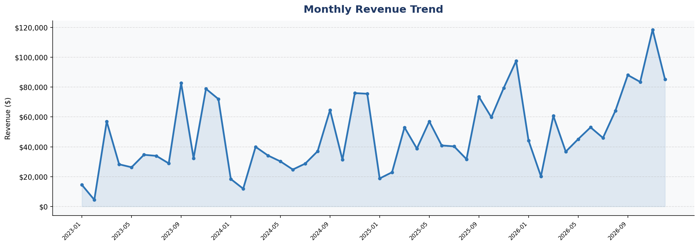

# 📊 Superstore Sales Analytics Dashboard

> End-to-end sales analysis using Excel, SQL, and Python

---

## 🔍 Business Problem

A retail superstore needed complete visibility into:
- Which products and regions drive the most revenue
- Where profit margins are being lost
- Monthly sales trends and growth patterns
- Top customers contributing to revenue

---

## 📈 Key Business Insights

| Metric | Value |
|---|---|
| Total Revenue | $2,326,534 |
| Total Profit | $292,297 |
| Profit Margin | 12.6% |
| Total Orders | 5,111 |
| Total Customers | 804 |
| Best Region | West ($739,814) |
| Best Category | Technology |
| Loss-making Sub-Category | Tables |

---

## 📊 Analysis Performed

### Excel Dashboard (5 Sheets)
- KPI Summary Dashboard with Cards
- Raw Data with Conditional Formatting
- Monthly Trend Analysis with Charts
- Category & Sub-Category Deep Dive
- Customer Analysis & Segment Report

### SQL Analysis (12 Queries)
- KPI Summary
- Monthly Revenue Trend
- Month-over-Month Growth (Window Functions)
- Category & Sub-Category Performance
- Regional Analysis
- Top 10 Customers
- Discount Impact Analysis
- Year-over-Year Comparison
- Loss-Making Products

### Python Visualizations (6 Charts)
- Monthly Revenue Trend
- Sales & Profit by Category
- Top 10 Sub-Categories by Revenue
- Regional Analysis (Bar + Pie)
- Top 10 Customers by Revenue
- Profit Heatmap (Category x Region)

---

## 🛠️ Tools Used

| Tool | Purpose |
|---|---|
| Microsoft Excel | Dashboard & KPI reporting |
| MySQL | Data analysis & SQL queries |
| Python (Pandas, Matplotlib, Seaborn) | EDA & visualization |
| Power BI | Interactive dashboard (coming soon) |

---

## 📁 Files

| File | Description |
|---|---|
| `Superstore_Excel_Dashboard.xlsx` | 5-sheet Excel dashboard |
| `Superstore_SQL_Queries.sql` | 12 analysis SQL queries |
| `chart1_monthly_trend.png` | Monthly revenue chart |
| `chart2_category_analysis.png` | Category comparison |
| `chart3_subcategory_revenue.png` | Top sub-categories |
| `chart4_regional_analysis.png` | Regional breakdown |
| `chart5_top_customers.png` | Customer analysis |
| `chart6_profit_heatmap.png` | Profit heatmap |

---

## 👤 Author

**Sudhir Kumar** — Data Analyst | MCA Data Science
[LinkedIn](https://linkedin.com/in/sudhir0703) • 
[Fiverr](https://fiverr.com/sudhir_excel1) • 
[Portfolio](https://sudhir0307.netlify.app)
